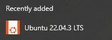
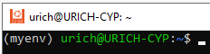
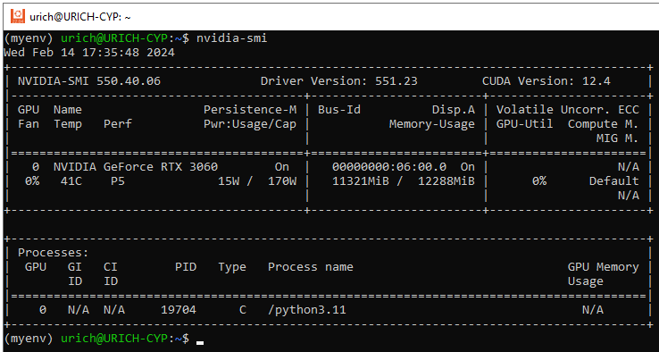
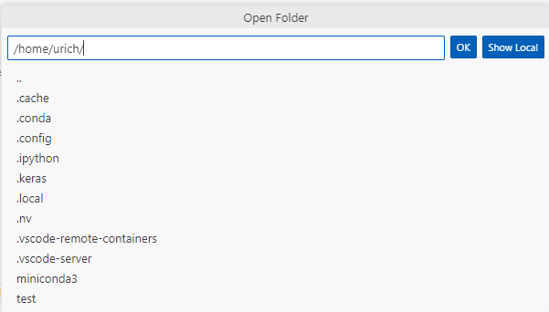
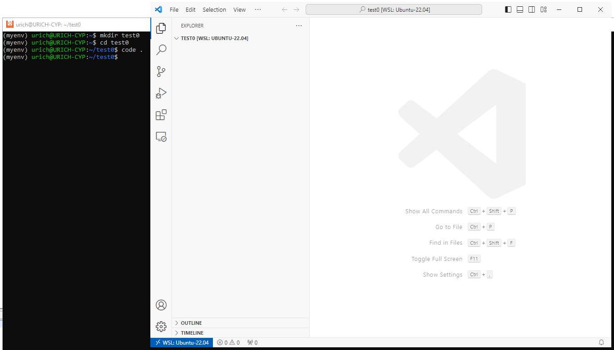
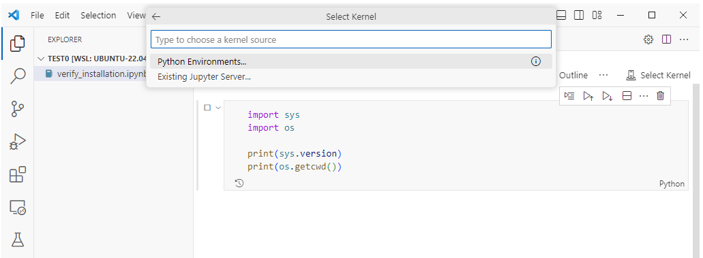
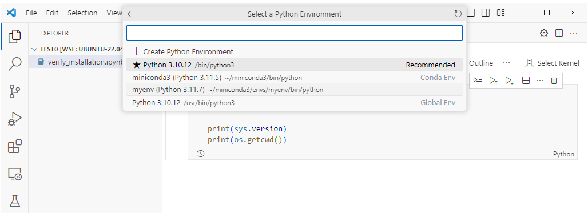
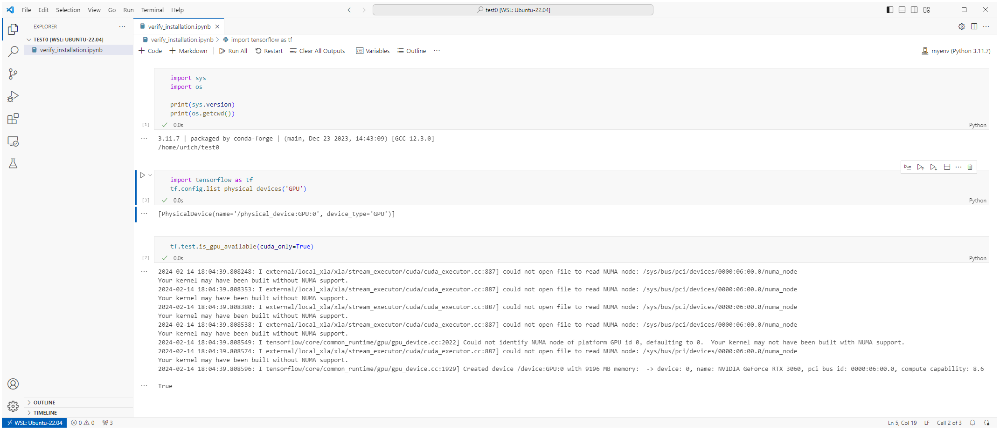

How to install Tensorflow with GPU support on Windows with WSL2


- [Test configuration](#test-configuration)
  - [Hardware](#hardware)
  - [Software](#software)
- [Prepare WSL2 environment](#prepare-wsl2-environment)
  - [Install WSL2](#install-wsl2)
  - [Install Ubuntu in WSL2](#install-ubuntu-in-wsl2)
  - [Install Miniconda](#install-miniconda)
  - [Install Python](#install-python)
- [Install NVIDIA drivers and toolkits](#install-nvidia-drivers-and-toolkits)
  - [Install NVIDIA Driver and CUDA Toolkit on Windows host machine](#install-nvidia-driver-and-cuda-toolkit-on-windows-host-machine)
  - [Install NVIDIA Cuda Toolkit in WSL2](#install-nvidia-cuda-toolkit-in-wsl2)
- [Install Tensorflow](#install-tensorflow)
- [Visual Studio Code with WSL2](#visual-studio-code-with-wsl2)

### Test configuration
#### Hardware
- AMD Ryzen 9 5900X 12-Core
- NVIDIA GeForce RTX 3060 12Gb
- Windows 10 Pro 22H2

#### Software
- NVIDIA Graphics Driver 551.23 (Windows)
- NVIDIA CUDA Toolkit 12.2 (Windows)
- WSL2 Kernel version: 5.10.102.1 (Windows)
- Ubuntu 22.04 LTS (in WSL2)
- Conda 24.1.1 (in WSL2)
- NVIDIA CUDA Toolkit 12.3 (in WSL2)
- Python 3.11 (in WSL2)
- Tensorflow[and-cuda] 2.15 (in WSL2)

### Prepare WSL2 environment

#### Install WSL2
Follow the guide: https://learn.microsoft.com/en-us/windows/wsl/install

OR
1. Run PowerShell as Administrator and execute ```wsl --install```
2. After installation is completed, make sure to default to WSL2 with ```wsl --set-default-version 2```

#### Install Ubuntu in WSL2
3. Run PowerShell as Administrator and execute ```wsl --install -d Ubuntu-22.04```
4. When operation is completed you get new Windows application installed and should be able to launch Ubuntu console from Start menu:

   

#### Install Miniconda
5. Launch Ubuntu and install Miniconda:
    ```bash
    wget https://repo.anaconda.com/miniconda/Miniconda3-latest-Linux-x86_64.sh
    chmod +x ./Miniconda3-latest-Linux-x86_64.sh
    ./Miniconda3-latest-Linux-x86_64.sh
    ```
6. Check installation and version:
    ```bash
    conda --version
    ```

#### Install Python
**Note**: versions are quite important. Please refer to this [table](https://www.tensorflow.org/install/source#gpu) for versions compatibility.

As of this guide, the most recent Tensorflow 2.15 is not compatible with Python 3.12; therefore, Python 3.11 is used.

7. Create new environment `myenv` with Python and activate it:

    ```bash
    conda --version
    conda update conda
    conda create -n myenv python=3.11
    conda activate myenv
    ```
    

### Install NVIDIA drivers and toolkits

#### Install NVIDIA Driver and CUDA Toolkit on Windows host machine
8. [NVIDIA Display Driver](https://www.nvidia.com/download/index.aspx) should be installed on host Windows machine

9. [NVIDIA CUDA Toolkit](https://developer.nvidia.com/cuda-downloads?target_os=Windows&target_arch=x86_64) should be installed on host Windows machine

#### Install NVIDIA Cuda Toolkit in WSL2
    
In Ubuntu `myenv`:

10.  Follow the guide: https://developer.nvidia.com/cuda-downloads?target_os=Linux&target_arch=x86_64&Distribution=WSL-Ubuntu&target_version=2.0&target_type=deb_local

        OR
        ```bash
        sudo apt-key del 7fa2af80

        wget https://developer.download.nvidia.com/compute/cuda/repos/wsl-ubuntu/x86_64/cuda-wsl-ubuntu.pin
        sudo mv cuda-wsl-ubuntu.pin /etc/apt/preferences.d/cuda-repository-pin-600
        wget https://developer.download.nvidia.com/compute/cuda/12.3.2/local_installers/cuda-repo-wsl-ubuntu-12-3-local_12.3.2-1_amd64.deb
        sudo dpkg -i cuda-repo-wsl-ubuntu-12-3-local_12.3.2-1_amd64.deb
        sudo cp /var/cuda-repo-wsl-ubuntu-12-3-local/cuda-*-keyring.gpg /usr/share/keyrings/
        sudo apt-get update
        sudo apt-get -y install cuda-toolkit-12-3
        ```

11.  Verify installation with `nvidia-smi`, you should see information about your GPU:


### Install Tensorflow
12. In Ubuntu `myenv`
    ```bash
    pip install tensorflow[and-cuda]
    ```
    Appropriate version of cuDNN is installed automatically.
13. Verify if Tensorflow is able to see GPU:
    ```bash
    python -c "import tensorflow as tf;print(tf.config.list_physical_devices('GPU'))"
    ```
    Should see line(s) like `[PhysicalDevice(name='/physical_device:GPU:0', device_type='GPU')]`.
    
    You can see warnings about missing NUMA support in kernel. It does not prevent Tensorflow from working. Looks like NUMA is not supported by Ubuntu kernel for WSL2:
```
(myenv) u@U-CYP:~$ python -c "import tensorflow as tf;print(tf.config.list_physical_devices('GPU'))"
2024-02-14 13:41:21.787581: E external/local_xla/xla/stream_executor/cuda/cuda_dnn.cc:9261] Unable to register cuDNN factory: Attempting to register factory for plugin cuDNN when one has already been registered
2024-02-14 13:41:21.787636: E external/local_xla/xla/stream_executor/cuda/cuda_fft.cc:607] Unable to register cuFFT factory: Attempting to register factory for plugin cuFFT when one has already been registered
2024-02-14 13:41:21.788220: E external/local_xla/xla/stream_executor/cuda/cuda_blas.cc:1515] Unable to register cuBLAS factory: Attempting to register factory for plugin cuBLAS when one has already been registered
2024-02-14 13:41:21.791826: I tensorflow/core/platform/cpu_feature_guard.cc:182] This TensorFlow binary is optimized to use available CPU instructions in performance-critical operations.
To enable the following instructions: AVX2 FMA, in other operations, rebuild TensorFlow with the appropriate compiler flags.
2024-02-14 13:41:22.256200: W tensorflow/compiler/tf2tensorrt/utils/py_utils.cc:38] TF-TRT Warning: Could not find TensorRT
2024-02-14 13:41:22.685412: I external/local_xla/xla/stream_executor/cuda/cuda_executor.cc:887] could not open file to read NUMA node: /sys/bus/pci/devices/0000:06:00.0/numa_node
Your kernel may have been built without NUMA support.
2024-02-14 13:41:22.717960: I external/local_xla/xla/stream_executor/cuda/cuda_executor.cc:887] could not open file to read NUMA node: /sys/bus/pci/devices/0000:06:00.0/numa_node
Your kernel may have been built without NUMA support.
2024-02-14 13:41:22.718041: I external/local_xla/xla/stream_executor/cuda/cuda_executor.cc:887] could not open file to read NUMA node: /sys/bus/pci/devices/0000:06:00.0/numa_node
Your kernel may have been built without NUMA support.
[PhysicalDevice(name='/physical_device:GPU:0', device_type='GPU')]
```

### Visual Studio Code with WSL2
1. Install [WSL extension](vscode:extension/ms-vscode-remote.remote-wsl)
2. Install [Remote Development extension](vscode:extension/ms-vscode-remote.remote-wsl)
3. (Optionally) Install [Jupyter extension](vscode:extension/ms-toolsai.jupyter)
4. (Optionally) Install ipykernel with `pip install ipykernel` in Ubuntu console
5. Now you should be able to open WSL2 folder from VSCode with File - Open Folder
   
   
   
   OR

   execute `code .` from Ubuntu console while in target folder
   
6. Create sample notebook or python file and try to launch it. It asks for execution environment:
   


7. Select `myenv`
   

8. Here is sample output that runs inside WSL2 and has GPU support for Tensorflow enabled. Again, there may be some ignorable warnings about NUMA support.
   

    That's it.